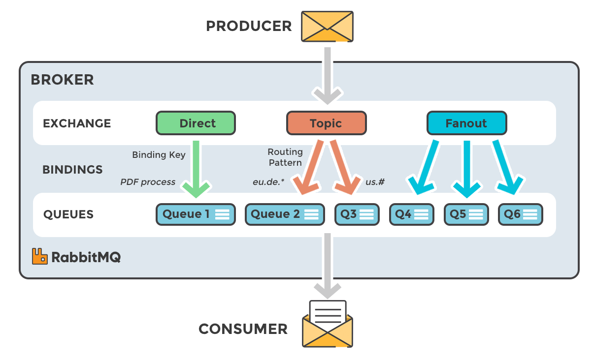

# estudart-rabbitmq-studies

RabbitMQ is a service designed to handle asynchronous communication between systems.

It acts as a **message broker**, with two main components: **producers** and **consumers**. Producers are responsible for publishing messages, while consumers receive and process those messages.

RabbitMQ offers a flexible and developer-friendly architecture using **exchanges** and **queues**. Every message published to RabbitMQ first goes to an exchange. From there, it gets routed to one or more queues, based on the exchange type and routing rules. These queues can then be consumed by one or multiple consumers.

This relationship — between exchanges, queues, and consumers — forms a powerful and scalable system for building decoupled, event-driven services.

# Example

In this image, is possible to understand how the message flow works within RabbitMQ, each type of exchange communicates to queues on it's own way, having different purposes.

* **Direct**: The message is routed to the queues whose binding key exactly matches the routing key of the message. For example, if the queue is bound to the exchange with the binding key pdfprocess, a message published to the exchange with a routing key pdfprocess is routed to that queue.
* **Fanout**: A fanout exchange routes messages to all of the queues bound to it.
* **Topic**: The topic exchange does a wildcard match between the routing key and the routing pattern specified in the binding.
* **Headers**: Headers exchanges use the message header attributes for routing.

# The UI

# Deeper concepts

* RabbitMQ uses AMQP protocol, a known protocol design for messaging communication between programs, used across many services such as: Apache Kafka, Azure Service Bus, IMB MQ Explorer
* RabbitMQ was developed using Erlang programming language